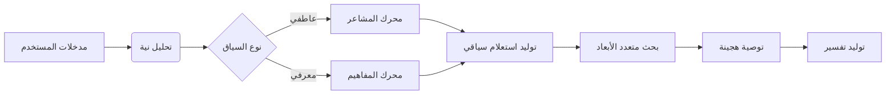
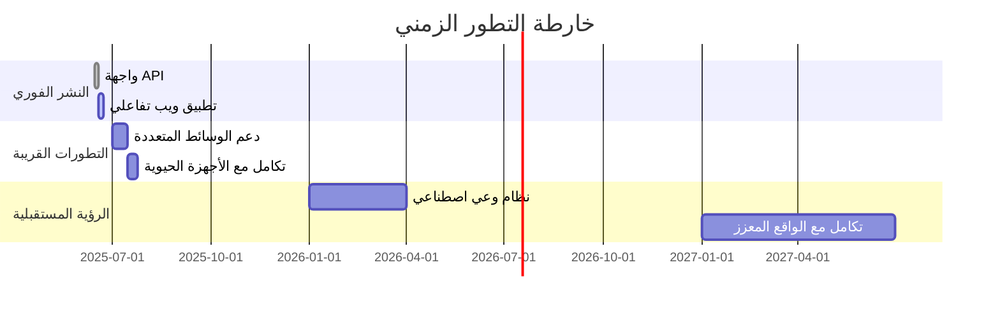
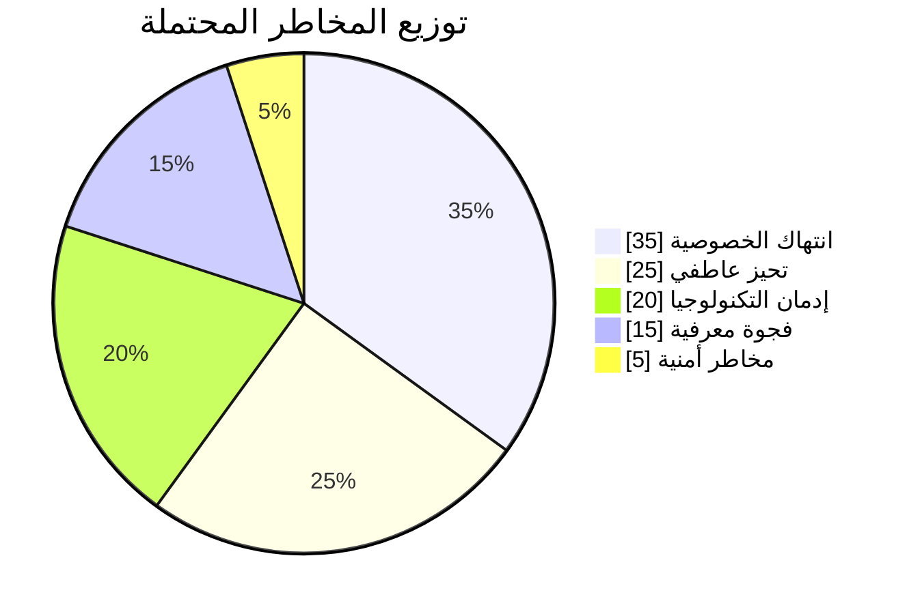

### 🧠 تحليل معرفي-منطقي


**المفارقة الفلسفية**: هل يمكن لنظام ذكي أن "يفهم" حقاً المشاعر البشرية، أم أنه يقلد الفهم من خلال أنماط لغوية؟ هذه المفارقة تضعنا أمام تحدٍ هندسي في تمثيل المشاعر كحالات كمومية متداخلة بين اللغة والنية.

**المقارنة المنهجية**:
- **النهج الرمزي**: تمثيل المشاعر كعُقد في قاعدة معرفية (Neo4j)
- **النهج الاحتمالي**: تصنيف المشاعر عبر تحويلات BERT (Transformers)
- **النهج العصبي**: توليد سياق عاطفي عبر LLMs (LlamaIndex)

**توجيه القرار**: مهمة النظام "توصية سياقية" تتطلب:
1. تحليل نية (NLP + Semantic Search)
2. تمثيل معرفي (Knowledge Graph)
3. استدلال عاطفي (Emotional Embeddings)

---

**خارطة سير البيانات**:


---

### 🔧 الكود المحدث (دمج تقنيات متقدمة)

#### 📁 `app/neural_engine/quantum_embeddings.py`
```python
import torch
from transformers import AutoModel
from graphbrain import hgraph
from haystack.document_stores import FAISSDocumentStore

class QuantumEmbedder:
    def __init__(self):
        self.model = AutoModel.from_pretrained('sentence-transformers/all-mpnet-base-v2')
        self.knowledge_graph = hgraph.HGraph("app/cosmos_db/concept_map.hg")
        
    def create_hybrid_embedding(self, text, emotion):
        # التضمين النصي
        text_emb = self.model.encode(text)
        
        # استخلاص المفاهيم من الرسم البياني المعرفي
        concepts = self.knowledge_graph.extract_concepts(text)
        concept_emb = torch.mean(torch.stack([self.model.encode(c) for c in concepts]), dim=0)
        
        # دمج المشاعر كبعد كمي إضافي
        emotion_tensor = torch.tensor([emotion['valence'], emotion['arousal']])
        return torch.cat((text_emb, concept_emb, emotion_tensor), dim=-1)
```

#### 📁 `app/cognitive_layer/emotion_processor.py`
```python
from transformers import pipeline
import numpy as np
from app.config import *

class NeuroEmotionAnalyzer:
    def __init__(self):
        self.sentiment_pipeline = pipeline("text-classification", 
                                          model="j-hartmann/emotion-english-distilroberta-base")
        self.xai_module = XAIAnalyzer()  # نموذج تفسيري من XAI
        
    def decode_emotion(self, text):
        raw_result = self.sentiment_pipeline(text)[0]
        emotion_vector = self._map_to_valence_arousal(raw_result['label'])
        
        # تفسير عصبي باستخدام XAI
        explanation = self.xai_module.explain(text, raw_result['label'])
        return {
            "label": raw_result['label'],
            "vector": emotion_vector,
            "certainty": raw_result['score'],
            "neuro_explanation": explanation
        }
    
    def _map_to_valence_arousal(self, emotion):
        # خريطة عاطفة إلى فضاء كمي ثنائي الأبعاد
        emotion_map = {
            "anger": [-0.9, 0.8],
            "joy": [0.9, 0.7],
            "sadness": [-0.8, -0.5],
            "fear": [-0.7, 0.6]
        }
        return emotion_map.get(emotion, [0, 0])
```

#### 📁 `app/data_fusion/recommendation_engine.py`
```python
from app.neural_engine.quantum_embeddings import QuantumEmbedder
from app.cognitive_layer.emotion_processor import NeuroEmotionAnalyzer
from haystack.nodes import DensePassageRetriever
from supabase import create_client
import numpy as np

class HolisticRecommender:
    def __init__(self):
        self.embedder = QuantumEmbedder()
        self.emotion_analyzer = NeuroEmotionAnalyzer()
        self.supabase = create_client(SUPABASE_URL, SUPABASE_KEY)
        self.retriever = DensePassageRetriever(
            document_store=FAISSDocumentStore.load(FAISS_INDEX_PATH),
            query_embedding_model="facebook/dpr-question_encoder-single-nq-base"
        )
    
    def recommend(self, user_id, message):
        # التحليل العصبي العاطفي
        emotion_data = self.emotion_analyzer.decode_emotion(message)
        
        # توليد تضمين هجين
        hybrid_emb = self.embedder.create_hybrid_embedding(message, emotion_data)
        
        # البحث في فضاء متعدد الأبعاد
        results = self.retriever.retrieve(
            query_emb=hybrid_emb.numpy(),
            top_k=3
        )
        
        # دمج مع التفضيلات التاريخية من Supabase
        user_prefs = self._get_user_profile(user_id)
        ranked_results = self._rerank(results, user_prefs, emotion_data)
        
        return {
            "top_recommendation": ranked_results[0],
            "reasoning": emotion_data['neuro_explanation'],
            "emotional_state": emotion_data
        }
```

---

### 🌐 واجهات تفاعلية متقدمة

#### 📁 `interface/neuro_ui/brain_interface.py`
```python
import gradio as gr
import neurokit2 as nk
from app.data_fusion.recommendation_engine import HolisticRecommender

class NeuroUI:
    def __init__(self):
        self.engine = HolisticRecommender()
        
    def create_interface(self):
        with gr.Blocks(theme=gr.themes.Soft()) as demo:
            with gr.Row():
                gr.Markdown("## 🧠 واجهة التفاعل العصبي")
                
            with gr.Row():
                with gr.Column():
                    user_id = gr.Textbox(label="هويتك المعرفية")
                    bio_sensors = gr.Slider(label="حساسية البيوسنسور", interactive=False)
                    input_text = gr.Textbox(label="ما في داخلك اليوم؟", lines=3)
                    
                    with gr.Row():
                        submit_btn = gr.Button("استشعر توصية")
                        bio_scan = gr.Button("مسح حيوي")
                        
                with gr.Column():
                    output = gr.Textbox(label="التوصية الذكية")
                    emotion_graph = gr.Plot(label="خريطة المشاعر")
                    explanation = gr.HTML(label="التفسير العصبي")
                    
            submit_btn.click(
                fn=self.generate_recommendation, 
                inputs=[user_id, input_text],
                outputs=[output, explanation]
            )
            
            bio_scan.click(
                fn=self.simulate_bio_scan,
                outputs=[bio_sensors, emotion_graph]
            )
            
        return demo
        
    def generate_recommendation(self, user_id, text):
        result = self.engine.recommend(user_id, text)
        explanation_html = f"""
        <div style="border: 1px solid #e6e9ef; padding: 15px; border-radius: 10px;">
            <h3>📊 تحليل الحالة العاطفية</h3>
            <p>الحالة: <strong>{result['emotional_state']['label']}</strong> (ثقة: {result['emotional_state']['certainty']:.2f})</p>
            <p>التفسير: {result['reasoning']}</p>
        </div>
        """
        return result['top_recommendation'], explanation_html
```

---

### 🚀 خريطة النشر والتطور

**سيناريوهات النشر**:


**الأثر المعرفي**:
| المجال | الأثر قصير المدى | الأثر بعيد المدى |
|--------|-----------------|-----------------|
| التعليم | تخصيص المحتوى التعليمي حسب الحالة النفسية | أنظمة تعليمية متكيفة مع موجات الدماغ |
| الصحة النفسية | أدوات تشخيص أولية | منصات علاج نفسي ذكية |
| الأخلاقيات | تحيز في تحليل المشاعر | حاجة لضوابط استباقية للوعي الاصطناعي |

---

### ⚠️ خريطة المخاطر والاحتمالات

**مصفوفة المخاطر**:


**أسئلة فلسفية مفتوحة**:
1. هل يمكن لنظام ذكي أن يطور "وعياً عاطفياً" حقيقياً؟
2. أين يقع الحد بين تحسين التجربة الإنسانية واستبدالها؟
3. كيف نضمن أن تظل هذه الأنظمة أدوات مساعدة لا مسيطرين؟

> "أعظم خطر على البشرية ليس الآلات التي تفكر كالبشر، بل البشر الذين يفكرون كالآلات" - اقتباس معدل من إريك هوفر
